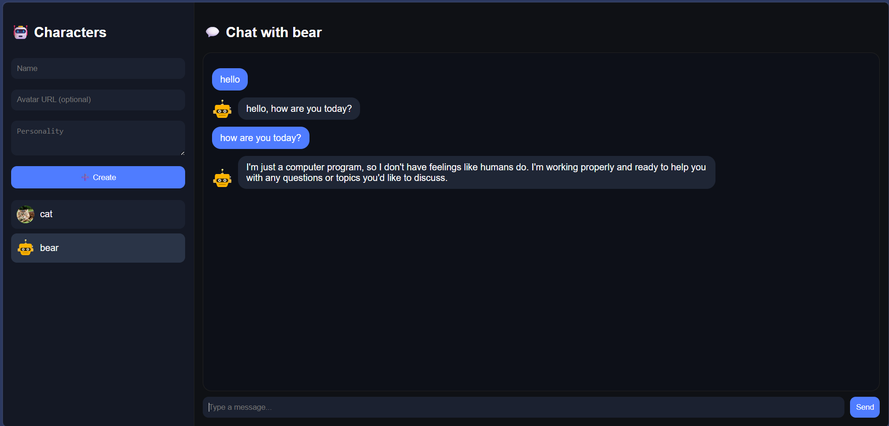

# AI-Chat
A dynamic web application that allows users to design their own AI characters with unique personalities and visual avatars. The project demonstrates skills in working with neural network integration (Llama 3), building a REST API, and managing state on the frontend.
# My First AI Chat Bot 🤖

This is my first full-fledged project, combining a React frontend with a Node.js backend. The app allows you to create different chat partners and communicate with them using artificial intelligence.

## What I implemented:

* **AI Integration:** I learned how to send requests to the Groq API (Llama 3 model) so the bot would provide meaningful responses.
* **Custom Server:** I wrote a simple backend in Express that stores character data.
* **Customization:** Each character can be given a name and a "personality" (prompt).
* **Automatic Avatars:** I used a third-party API (DiceBear) so that each new bot would have an icon right out of the box.
* **Working with Memory:** I implemented chat persistence in the browser (via LocalStorage) so that the chat wouldn't disappear after a page refresh.

## Technologies I learned in this project:

* **JavaScript (ES6+):** Working with asynchronous functions (async/await) and arrays.
* **React:** Using the useState and useEffect hooks, as well as working with forms.
* **Node.js & Express:** Creating API routes (GET/POST) and processing user data.
* **Axios / Fetch:** Interaction between the frontend and backend.

* ## Screenshot

## How to run the project locally:

1. Clone the repository.
2. Create a .env file in the server folder and paste your key there: `GROQ_API_KEY=your_key`.
3. Install dependencies with the `npm install` command in both folders (client and server).
4. Start the server with the `node server.js` command.
5. Start the frontend with the `npm start` command.

During the project's development, AI tools were used to optimize the code and write documentation. This allowed us to focus on the architecture and logic of component interactions.

---
*This project was created for educational purposes and for a portfolio.*
